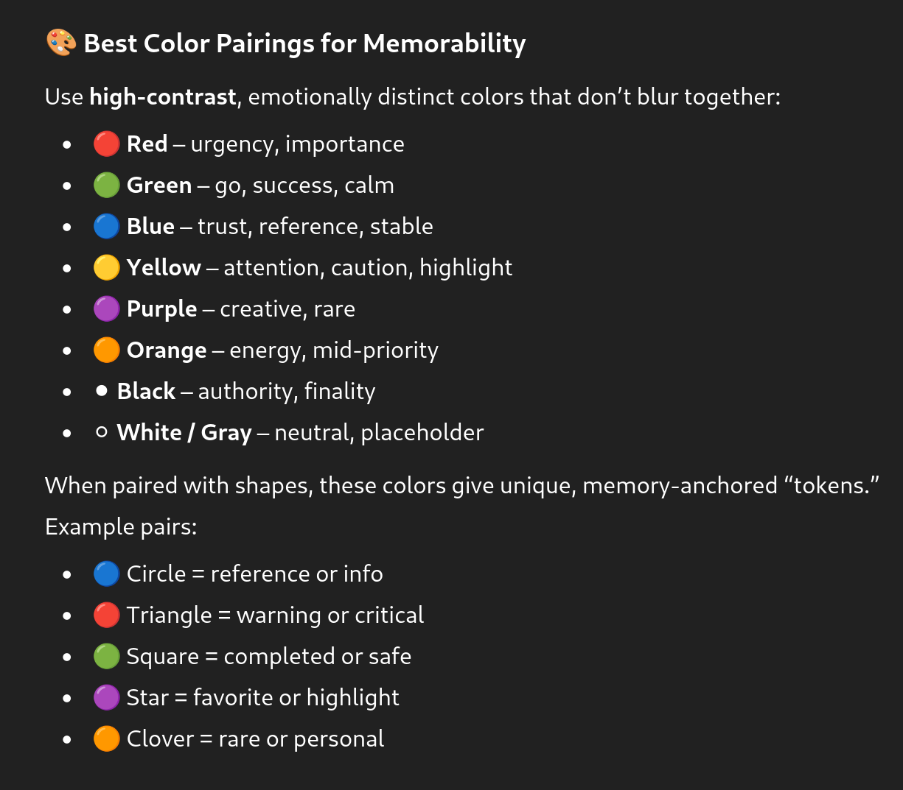

# memorability.md

## Tips for Memory & Recognition

- Keep no more than 7-10 distinct combinations 
per book (human short-term visual memory limit).
- Use consistent meaning (e.g., blue circles always mean “reference links).

## Best Color Pairings for Memorability

